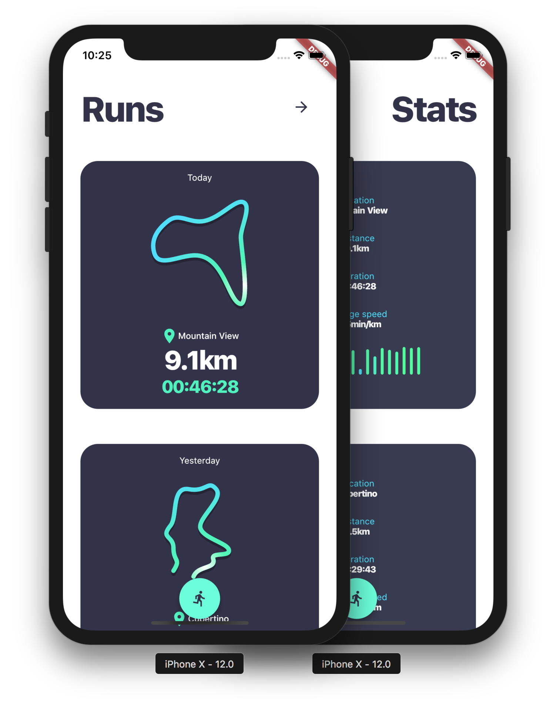

# #FlutterCreate Run submission

This my submission for the [FlutterCreate](https://flutter.dev/create) contest which consist of creating a nice user experience in less that 5KB of code.

The application is inspired by Running apps and consists of a list of runs. I tried to put as much things in a single little app : custom animated drawing with animated paths, custom data, dynamic user interactions with a swipe that leads to run details (*this allows for comparing details too*).

Also I didn't want to rely on heavy dependencies for nice UI (like Flare, or Widgets) in order to prove that Flutter has everyting needed to create great animated UIs. I just used two packages : `flutter_hooks` for reducing a lot statefull widget declarations, and `path_drawing` for generating paths from string data.

All the code is available in the [lib/main.dart file](lib/main.dart).

## Disclaimer

A lot of bad practices are used in this project since the most important factor here is the codebase size! Don't reproduce it in your regular projects, mainly :

* **Short naming** : a lot of variables are named with a few characters which doesn't make it easy to read.
* **`var` only**: use `final` keyword when your value isn't modified after its declaration
* **Accessing enums by index**: if the enumeration values order changes, you code wouldn't access the right values. 
* **`dynamic` by omitting type declaration**: precise all types when possible.
* **Functions for widgets** : Classes should be declared for widgets instead of functions (or use [functional_widget](https://github.com/rrousselGit/functional_widget) to generate them).
* **Accessing json properties with magic strings**: use code generators to generate serializers ([json_serializable](https://github.com/dart-lang/json_serializable)).
* **Everything in the view** : adopt an architectural pattern (like [BLoC](https://aloisdeniel.com/post/p9OCupX71qaLtGYHpnV0) or [scoped_model](https://github.com/brianegan/scoped_model)) to separate your concerns.
* **A single file** : use multiple files to simply code organization.

## Notes 

The prebaked [runs.json data file](data/run.json) is generated with the [script](bin/points_gen.d) by calling `dart bin/points_gen.d`.